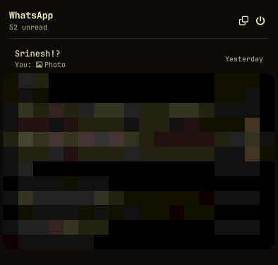
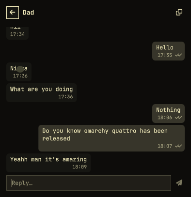

# WhatsApp for Omarchy

**Using the shared priority build?** Start with [START_HERE.md](START_HERE.md).

WhatsApp in the Omarchy Quattro bar: unread badge, desktop notifications you can
click, chat actions without leaving the bar, and one keystroke to the full
WhatsApp Web client when you need calls, search, or unsupported media.

The hover preview and main chat list put individuals first and keep groups in a
collapsed section. Archived chats are omitted from both views and the main search.
Received videos and video notes can be played in the chat panel: click the video
tile, or select its message and press **V**. Playback opens in a full-screen
viewer; **Space** pauses, **Left/Right** seek five seconds, and **Esc** closes it.
Videos download only when opened and are limited to 100 MB. Playback requires
the `qt6-multimedia` package and codecs supported by your system.
Older video entries saved by previous releases ask the linked phone for their
media details when opened; WhatsApp may no longer be able to return some of them.
Voice notes and other audio play directly in the chat bubble: click the play
control or select the message and press **P**. Documents have a download tile;
click it or select the message and press **S** to save a copy in your Downloads
folder. Audio and documents download only when opened, with 50 MB and 200 MB
limits respectively. Existing filenames are never overwritten.
To send a voice note, click the microphone in a chat or press **Ctrl+Shift+R**.
Click Stop or press the shortcut again, play the preview, then click Send.
The × button or **Escape** discards it. Recording stops automatically after
three minutes; nothing is sent until you press Send.
If the preview is silent, open Settings and choose a specific voice-note
microphone. The plugin lists the available inputs and leaves your system-wide
default unchanged. Your choice survives shell restarts and plugin updates.
Near-silent recordings show an error before Send.
Use the copy icon at the top-right of a message bubble to copy its text or,
for an image or sticker, the image itself. Images download first if needed.
JPEG, WebP, and GIF images are copied as PNG for compatibility with desktop apps.
Select a message and press **C** for the same
action. The header's external-link icon opens the full WhatsApp Web client.
Your own text bubbles also have a pencil icon for editing. The draft remains
in the composer until the bridge confirms the change, and remains available if
the edit fails. The conversation loads the full local cache of up to 200 messages.
The chat header's magnifying glass searches that conversation's cached message
text; its grid icon opens local photos, videos, documents, and audio. Search and
gallery browsing do not fetch older messages or uncached attachments.

<p align="center">
  
  
</p>

## How it works

Two pieces, on purpose:

| Piece | Job |
|-------|-----|
| **Bridge daemon** (Node + [Baileys](https://github.com/WhiskeySockets/Baileys)) | Holds one linked-device session, receives messages, sends notifications, handles chat actions |
| **Bar plugin** (QML) | Unread badge, chat list, conversation view, message actions, composer |

They talk NDJSON over a unix socket in `$XDG_RUNTIME_DIR` — no localhost port,
no auth token, no browser running in the background just to get a notification.
The daemon is the fan-out point, so bars on several monitors stay in sync and a
notification click reaches whichever panel is on screen.

The **full client** is separate on purpose too: the bar panel is for reading and
replying, and the WhatsApp Web app window handles everything heavier. WhatsApp
allows up to four linked devices, so the bridge and the web app can be linked at
the same time.

## Install

For this priority build:

```sh
omarchy plugin add https://github.com/HazIQ-DevOps/omarchy-whatsapp-priority.git --enable
```

See [START_HERE.md](START_HERE.md) for the complete steps and existing-install guidance.

For the original upstream plugin:

```sh
omarchy plugin add https://github.com/srineshr1/omarchy-whatsapp.git --enable --yes
```

That is enough. The first time the widget starts it installs Node deps, the
`omarchy-whatsapp` user service, and CLI links. Click the icon and press Login.

From a source checkout instead:

```sh
git clone https://github.com/srineshr1/omarchy-whatsapp.git
cd omarchy-whatsapp
./install.sh
```

Requirements: Omarchy 4 (Quattro), Node.js 20+, `qt6-multimedia`, `pipewire-audio`
(`pw-record`), and `ffmpeg` for outgoing voice notes and image copying. If Node lives in a version
manager (mise, proto, fnm, volta, nvm) setup finds it and pins the path into
the service unit.

## Link your account

Click the WhatsApp icon in the bar and scan the QR code, or:

```sh
omarchy-whatsapp login                 # QR in the terminal
omarchy-whatsapp login --pair 919812345678   # 8-digit code instead
```

On your phone: **Settings → Linked devices → Link a device**.

The code refreshes itself every ~20 seconds (WhatsApp expires each one), so the
panel always shows a live code — no need to reopen anything.

After five minutes without a scan the daemon **pauses** and removes the code
rather than leave an expired one on screen looking scannable. The panel then
offers **Show QR code**, and `omarchy-whatsapp login` reopens the window too.
That cap also keeps an unlinked install from polling WhatsApp's pairing endpoint
forever. To change it:

```sh
systemctl --user edit omarchy-whatsapp     # Environment=OMARCHY_WHATSAPP_PAIRING_WINDOW_MS=600000
```

## Use it

| Action | How |
|--------|-----|
| Open the panel | Click the bar icon |
| Open a contact from the hover summary | Click that contact's card |
| Open the full chat list | Click the WhatsApp heading, the hover card footer, or the bar icon |
| Search recent chats | Click the search icon in the hover summary, or press `/` in the chat list |
| Move through chats | `j` / `k` or arrow keys |
| Refresh chats | Refresh button, or `r` |
| Open a chat | `Enter` |
| Reply | Type, then `Enter` |
| Add emoji | Use the smile button or `Ctrl+E` in a chat, then arrows and `Enter`; or type `:)`, `:D`, `LOL`, `;)`, `:(`, `:P`, or `<3` |
| Send a copied image | In a chat, press `Ctrl+V`, check the preview, optionally add a caption, then press `Enter` or Send |
| Record a voice note | Click the microphone or press `Ctrl+Shift+R` to start and stop; preview it, then press Send. Use × or `Escape` to discard |
| Select a message | Click its bubble, or press `Ctrl+Up` from the composer; use arrows to move between messages |
| Reply with a quote | Select a message, then press `R` or Reply; type and send |
| Forward | Select a text, image, or sticker message, press `F`, search for a recipient, then click or press `Enter` |
| React | Select a message and press `A`; choose an emoji with arrows and `Enter`. Press `0` to remove your reaction |
| Edit your text | Select your message and press `E`; change it in the composer and send |
| Delete | Select a message, press `D` to delete for yourself, or `X` to delete your own message for everyone; confirm in the dialog |
| Back to the chat list | `Escape` |
| Close the panel | `Escape` from the list |
| Full WhatsApp Web | Right-click the icon, or use the ⧉ button in the panel |
| Log out | Power button on the chat list |
| Open a chat from a notification | Click the notification |

Opening a chat marks it read on every device. Messages arriving while a
conversation is open are marked read immediately.
The panel forwards text, images, and stickers that still have their original
media metadata. For other message types, use the full WhatsApp client. WhatsApp
may reject edits or deletions outside its allowed window; the panel reports
the error without changing the stored message.

A single check on an outgoing message means WhatsApp's server accepted it; it
does not prove the recipient decrypted it. If a recipient sees “Waiting for this
message,” send urgent messages from your primary phone while checking the
linked-device session. WhatsApp's [help page](https://faq.whatsapp.com/3398056720476987/)
recommends getting both phones online, updating WhatsApp, resending, and
relinking the device if the problem persists.

Desktop alerts and the bar's unread total follow WhatsApp's chat preferences:
muted chats (including **Always**) and chats that remain archived do not alert
or add to the total. Timed mutes expire automatically and refresh the badge.
If WhatsApp is set to unarchive a chat when a new message arrives, that
now-active chat alerts as normal. After upgrading, reconnect once so Always
mutes muted before this fix are rewritten from WhatsApp app-state.

## CLI

```sh
omarchy-whatsapp status                          # connection, account, unread
omarchy-whatsapp send 919812345678@s.whatsapp.net "on my way"
omarchy-whatsapp chats 10                        # recent chats as JSON
omarchy-whatsapp refresh                         # resync the chat list from WhatsApp
omarchy-whatsapp focus 919812345678@s.whatsapp.net   # open the panel on a chat
omarchy-whatsapp open                            # full web client
omarchy-whatsapp restart | logs | logout
omarchy-whatsapp uninstall                       # service, CLI, credentials
```

The first widget start (or `omarchy-whatsapp setup`) links these into
`~/.local/bin`. `omarchy-whatsapp-ctl -h` lists the raw daemon commands.

Disabling the bar plugin also disables and stops the `omarchy-whatsapp` user
service (the unit uses `Restart=on-failure` so a clean disable exit does not
come back). Re-enabling the plugin starts it again when `autostartDaemon` is
enabled.

## Settings

Per-widget settings live inline on the bar entry in `~/.config/omarchy/shell.json`
and hot-reload on save:

```json
{ "id": "io.github.ricky.whatsapp", "showUnreadCount": true, "chatLimit": 40 }
```

| Key | Default | Meaning |
|-----|---------|---------|
| `socketPath` | `""` | Daemon socket; blank uses `$XDG_RUNTIME_DIR/omarchy-whatsapp.sock` |
| `autostartDaemon` | `true` | Start the daemon if the socket is missing |
| `showUnreadCount` | `true` | Show the count next to the icon |
| `priorityName` | `""` | One sender name; show the unread indicator in red while they have unread messages |
| `hideWhenEmpty` | `false` | Hide the widget entirely when nothing is unread |
| `chatLimit` | `40` | Chats listed in the panel |
| `messageLimit` | `200` | Messages loaded per conversation (the local cache maximum) |
| `webAppUrl` | `https://web.whatsapp.com` | Full client URL |
| `webAppPattern` | `web.whatsapp.com` | Window pattern used to focus the full client |

Move the widget:

```sh
omarchy bar move io.github.ricky.whatsapp --section right
```

## What it stores, and where

| Path | Contents |
|------|----------|
| `~/.local/state/omarchy-whatsapp/auth/` | Linked-device credentials and Signal keys (`0700`) |
| `~/.local/state/omarchy-whatsapp/store.json` | Recent chats and up to 200 messages per chat (`0600`) |
| `~/.local/state/omarchy-whatsapp/retry/` | Original sent message payloads for accurate resend requests; at most 1,000 entries retained for up to seven days (`0700` directory, `0600` files) |
| `$XDG_RUNTIME_DIR/omarchy-whatsapp.sock` | Control socket (`0600`, cleared on logout) |

Nothing leaves your machine except traffic to WhatsApp itself. Incoming images
and stickers up to 12 MB may be downloaded into the local media cache so they
can appear inline. Videos and audio download on demand into the media cache;
documents download on demand and are copied to your Downloads folder. A copied
image or recorded voice note remains in a private runtime file until you send
or remove it. Voice notes are encoded as Ogg Opus and sent as WhatsApp
push-to-talk audio.

`omarchy-whatsapp logout` unlinks the device and clears credentials, chats, retry payloads, and cached media. Documents explicitly saved to Downloads remain there.

Disabling the bar widget with `omarchy plugin disable io.github.ricky.whatsapp`
also stops and disables the WhatsApp user service. Linked-device credentials
and the chat cache are retained, so enabling the widget again can resume
without another QR scan. To stop the service and delete local data, use
`omarchy-whatsapp uninstall` instead.

## Things worth knowing before you install

- **Baileys is an unofficial WhatsApp Web client.** It is not endorsed by
  WhatsApp, and using it carries some risk to your account. It is the same
  mechanism every WhatsApp bridge on Linux uses, but the risk is yours.
- **The protocol library is pinned to `baileys@7.0.0-rc14`.** This release
  supports LID session migration and automatic session recovery. The older
  6.x library could fail to decrypt messages when an address changed between
  its phone-number and LID forms. Startup checks the installed version and
  installs the pinned dependencies when needed.
- **Plugins run unsandboxed inside `omarchy-shell`.** This one keeps its network
  and protocol work in a separate process for exactly that reason — the QML side
  only parses JSON from a socket it owns — but you should still read the code
  before enabling it.
- **The daemon stays "offline" to WhatsApp** (`markOnlineOnConnect: false`) so
  your phone keeps its own notifications working.
- **Read receipts are sent** when you open a chat, the same as opening it on your
  phone.

## Troubleshooting

**Icon is dim / "Daemon offline"**

```sh
systemctl --user status omarchy-whatsapp
journalctl --user -u omarchy-whatsapp -n 50
```

**"no Node.js >= 20 found"** — install `nodejs`, or point the service at your
interpreter: `systemctl --user edit omarchy-whatsapp` and add
`Environment=OMARCHY_WHATSAPP_NODE=/path/to/node`.

**Daemon restart-loops / `EALLOWGIT` / `Permission denied (publickey)`**

Update the plugin: the current dependency lockfile uses npm registry packages
for both Baileys and libsignal. It no longer needs a GitHub SSH key or npm's
git-dependency opt-in. Dependencies are installed on first start or when the
pinned Baileys version changes.

**Recipients see "Waiting for this message"**

The bridge needs a working Signal session for each recipient device. This
build includes LID session migration and stores original outgoing payloads
so retry requests after a daemon restart retain quotes, media metadata,
reactions, edits, and deletes. A server acknowledgement alone does not prove
that a recipient decrypted a message. Test with a newly sent message and
confirm it is readable on the receiving phone; older placeholders may need
the sender to send the content again.

**Widget not in the bar**

```sh
omarchy plugin list --json | jq '.[] | select(.id == "io.github.ricky.whatsapp")'
omarchy-shell shell rescanPlugins
qs log -p "$OMARCHY_PATH/shell" --tail 100
```

**Stuck on "Reconnecting…"** — `omarchy-whatsapp ctl reconnect`, then re-link
with `omarchy-whatsapp login` if the phone dropped the device.

## Remove

```sh
omarchy plugin remove io.github.ricky.whatsapp
```

The next login (or `systemctl --user start omarchy-whatsapp-sweep`) deletes the
user service, CLI links, credentials, and chat cache. To wipe immediately:

```sh
omarchy-whatsapp uninstall
# or, from a source checkout:
./install.sh --uninstall
```

## License

MIT. See [LICENSE](LICENSE).
